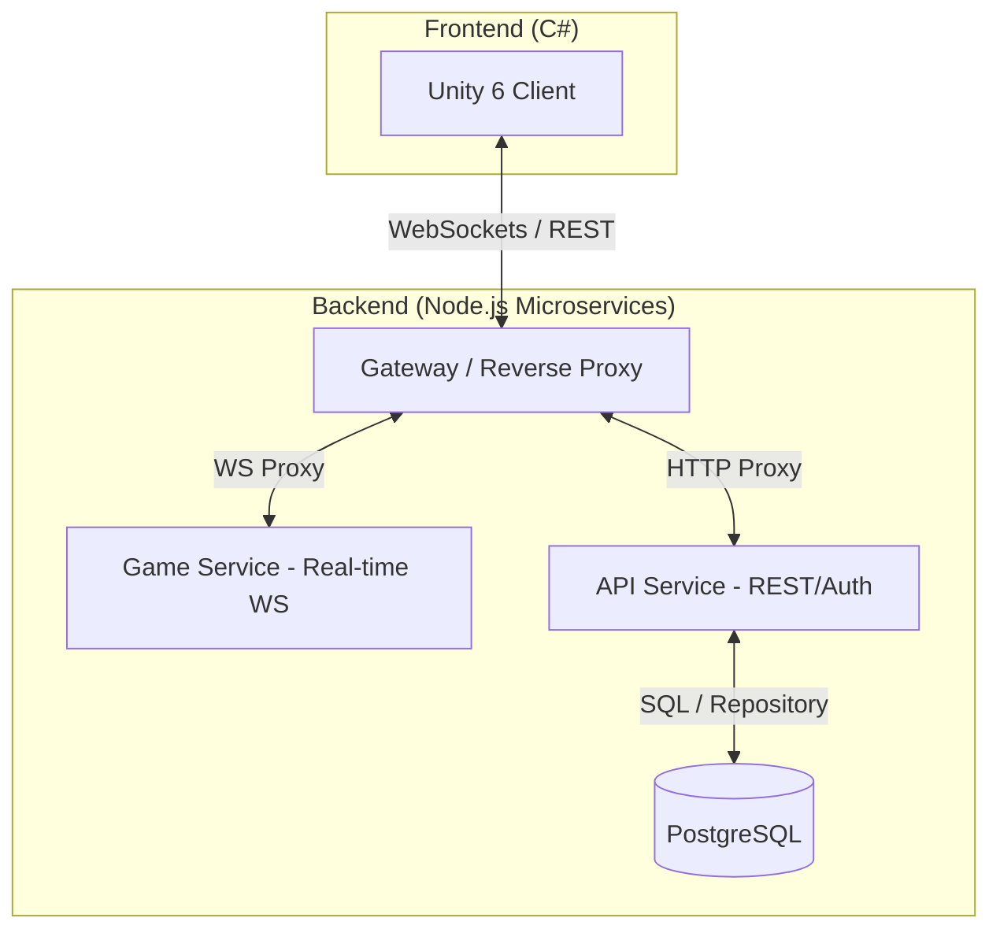

# 💀 Infernal Survival: AEA Edition 💀

[](https://unity.com/)
[](https://nodejs.org/)
[](https://www.postgresql.org/)
[](https://github.com/google/gemini-cli)

## 📄 Abstract (Resum)

**Proyecto:** Infernal Survival: AEA Edition  
**Curso:** 2DAM 2025-2026  
**Integrante:** Marc Caramontes  

**Objetivo:**  
Infernal Survival es un shooter de supervivencia 1vs1 online con estética retro. Los jugadores deben sobrevivir en una arena competitiva enfrentando hordas de enemigos con IA predictiva y agentes inteligentes entrenados mediante ML-Agents.

**Arquitectura:**  
El sistema emplea una arquitectura de microservicios distribuida sobre Node.js:
- **Tecnologías:** Unity 6 (URP), Node.js (Gateway, Game & API Services), PostgreSQL y WebSockets nativos.
- **Componentes:** Unity Client (gameplay/UI), Gateway (proxy/seguridad), Game Service (sincronización tiempo real) y API Service (persistencia).
- **Interrelación:** El cliente conecta al Gateway, que redirige el tráfico de red al Game Service y las peticiones REST al API Service, validando la identidad del jugador en cada paquete.

[🎥 Vídeo de Presentación (Canva)](https://www.canva.com/design/TU-LINK-AQUI)

---

## 🌑 La Experiencia "Infernal"

El proyecto trasciende los prototipos convencionales mediante una atmósfera opresiva y técnica:
- **Atmósfera de Abismo:** Inspirado en *Devil Daggers*, utiliza un sistema de iluminación dinámica 2D centrado en el jugador y post-procesado agresivo (Vignette, Film Grain, Bloom).
- **IA Predictiva:** Enemies que no solo persiguen, sino que interceptan la trayectoria del jugador.
- **ML-Agents Integration:** Agentes "Hunter" entrenados mediante aprendizaje por refuerzo para optimizar la persecución.
- **Sistema de Oleadas:** Progresión dinámica de dificultad con picos de intensidad y periodos de calma.

## 🛠️ Stack Tecnológico

### Frontend (Unity 6)
- **Motor:** Unity 6 (6000.0.35f2) con Universal Render Pipeline (URP 17).
- **Networking:** WebSockets nativos (protocolo JSON puro) para una comunicación de ultra-baja latencia.
- **Feedback:** Sistema de partículas pixeladas y respuesta háptica visual para cada interacción.

### Backend (Microservicios)
Arquitectura distribuida y escalable dividida en tres servicios independientes:
- **Gateway:** Proxy centralizado que gestiona el acceso y la seguridad.
- **API Service:** Gestión de perfiles, persistencia y tablas de clasificación.
- **Game Service:** Orquestación de estados de juego y sincronización de identidad en tiempo real.
- **Persistencia:** Base de datos **PostgreSQL** (con fallback a SQLite para desarrollo) mediante el patrón Repository.

---

## 🧬 Desarrollo Dirigido por Especificaciones (Spec-Driven)

Este proyecto se ha construido bajo la metodología **OpenSpec**, donde cada línea de código nace de una decisión de diseño documentada:

1.  **Exploración:** Análisis de viabilidad y arquitectura.
2.  **Design Docs:** Definición de esquemas de datos, diagramas de flujo y contratos de API.
3.  **Specs:** Documentación técnica que define las "Capabilities" del sistema.
4.  **Implementation:** Ciclos de desarrollo incrementales validados por IA para garantizar la estabilidad en Unity 6.

---

## 🏗️ Arquitectura del Sistema



### Características de Red:
- **Server-Side Identity Injection:** El servidor garantiza la identidad de los paquetes, eliminando la posibilidad de suplantación.
- **Lazy Ghost Spawning:** Sistema de instanciación bajo demanda para reducir el consumo de recursos.
- **Resiliencia:** Recuperación automática de la UI y limpieza de estados en caso de desconexión.

---

## 🚀 Instalación y Uso

### Servidor
```bash
cd Server
npm install
npm run start # Inicia Gateway, API y Game Service simultáneamente (start-all.js)
```

### Unity
1. Abre el proyecto con **Unity 6 (6000.0.35f2)**.
2. Abre la escena `Assets/Scenes/Menu.unity`.
3. Configura la dirección del servidor en el objeto `NetworkManager`.

---

## ✒️ Autor
- **Marc Caramontes** - *Desarrollo Integral y Arquitectura*
