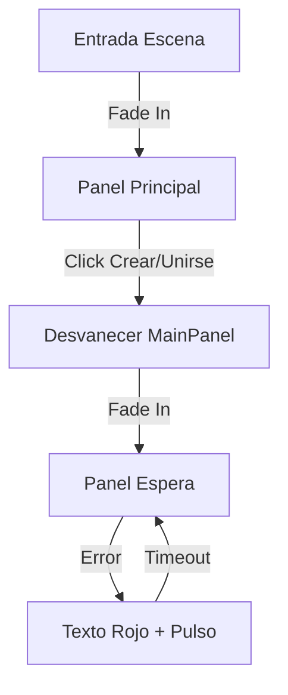

## Context

El `LobbyController` actual maneja la visibilidad de los paneles de UI mediante `gameObject.SetActive()`. Esto produce cambios de estado instantáneos que resultan visualmente toscos. Ya disponemos de un `UIAnimationManager` y componentes de `CanvasGroup` en otras partes del proyecto (como en el Game Over) que permiten transiciones suaves.

## Goals / Non-Goals

**Goals:**
- Implementar transiciones de Fade In/Out entre el panel principal y el panel de espera del Lobby.
- Estandarizar el feedback táctico de los botones mediante `ButtonHoverEffect`.
- Destacar el código de sala generado mediante animaciones de escala.
- Asegurar que el estado visual del Lobby refleje correctamente el flujo de conexión HTTP/Socket.

**Non-Goals:**
- Rediseñar el layout artístico del Lobby.
- Añadir lista de jugadores en tiempo real (fuera de alcance actual).
- Modificar la lógica de red de `NetworkManager`.

## Decisions

### 1. Gestión de Visibilidad mediante CanvasGroup
- **Decisión**: Añadir `CanvasGroup` a `MainPanel` y `WaitingPanel` y manipular su `alpha` e `interactable` en lugar de usar `SetActive`.
- **Razón**: Permite transiciones suaves mediante interpolación lineal (Lerp) sin desactivar los objetos, lo cual es necesario para que las corrutinas de animación finalicen correctamente.
- **Alternativa**: Usar `Animator` de Unity. *Rechazada* por ser más pesada y menos flexible para cambios dinámicos de texto.

### 2. Integración con UIAnimationManager
- **Decisión**: El `LobbyController` llamará a `UIAnimationManager.Instance.FadeCanvasGroup` y `PulseScale`.
- **Razón**: Centraliza la lógica de animación y asegura consistencia visual con el resto del juego.

### 3. Feedback Visual de Errores
- **Decisión**: Cuando ocurra un error de conexión, el texto de estado cambiará a rojo y se disparará un `PulseScale(1.05f)`.
- **Razón**: Atrae la atención del usuario de forma no intrusiva pero clara hacia el mensaje de error.

## Risks / Trade-offs

- **[Risk]** → Interferencia con clics durante las transiciones. 
  - **Mitigation**: Desactivar `interactable` y `blocksRaycasts` en el `CanvasGroup` mientras el `alpha` sea menor que 1.
- **[Risk]** → `UIAnimationManager` no presente en la escena del Lobby.
  - **Mitigation**: Actualizar `SceneSetupHelper` o añadir un prefab de `_Managers` al Lobby.

## UI State Flow Diagram

