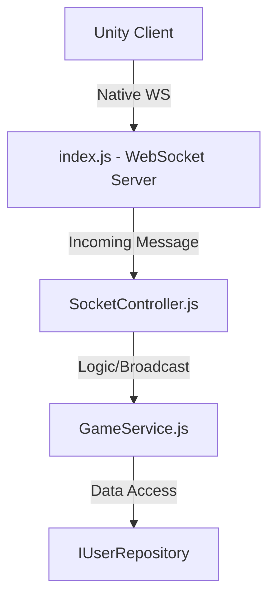

## Context

The `game-service` handles all WebSocket communication for active matches. Currently, all event logic (routing, state management, broadcasting) is co-located in `index.js`, making it hard to maintain and violating technical requirement 4.2 (Layered Architecture/Repository Pattern).

## Goals / Non-Goals

**Goals:**
- Separate the WebSocket routing (Dispatcher) from the game logic (Service).
- Decouple the service layer from persistence (Repositories).
- Keep using native `ws` as per requirement 4.1.

**Non-Goals:**
- Changing the networking protocol or packet structure.
- Adding a complex state management system for match physics (this remains server-side but minimalist).

## Decisions

### Decision 1: Socket Dispatcher Pattern (SocketController)
**Rationale:** Unlike Express, WebSockets are event-driven. We'll implement a `SocketController` that receives a message, parses its `type`, and calls the corresponding `GameService` method.
**Alternatives:** Using a library like `socket.io` (prohibited by requirement 4.1).

### Decision 2: Centralized GameState in GameService
**Rationale:** The `rooms` Map and player connection/disconnection logic will live in `GameService`. This makes the service the "source of truth" for the current session.

### Decision 3: Interface-based Repository access
**Rationale:** Just like in the `api-service`, the `GameService` will receive the `IUserRepository` implementation via constructor injection, ensuring requirement 4.2 compliance.

## Risks / Trade-offs

- **[Risk]** Packet parsing errors in the new controller could break synchronization.
  - **Mitigation:** Wrap the dispatcher in a try-catch block and log unknown message types clearly.
- **[Trade-off]** More files for a relatively small service.
  - **Rationale:** Necessary for compliance and long-term modularity.

## Architecture Diagram

